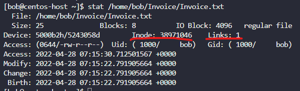
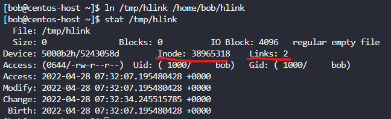
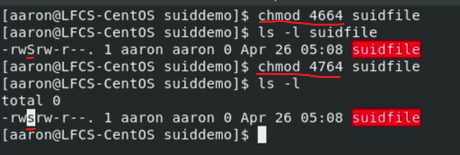
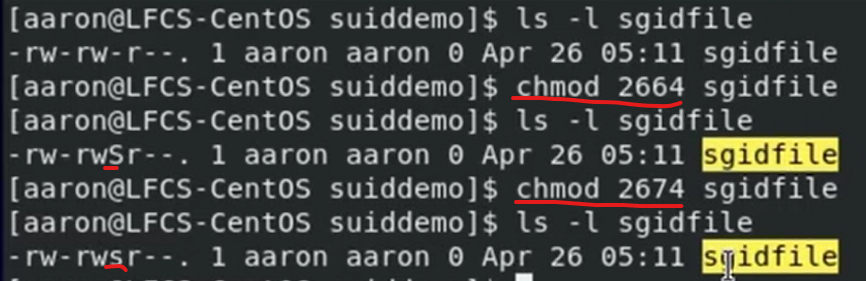
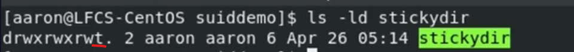
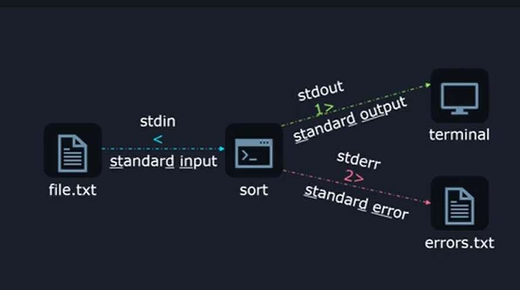

# LINUX FOUNDATION CERTIFIED SYSTEM ADMINISTRATOR (LFCS)

## Additional Resources

- web <https://kodekloud.com/courses/linux-foundation-certified-system-administrator-lfcs/>
- regxr.com

## Table of Contents

1. Introduction
2. Essential Commands
3. Operation of Running Systems
4. User and Group Management
5. Networking
6. Service Configuration
7. Storage Management
8. Conclusion

## 2. Essential Commands

### 2.01. Log into local & remote graphical and text mode consoles

- `ip a` to see local IP address

SSH = Secure SHell, all data is encrypted.

- `ssh daemon` on server listens for incoming connections
- `ssh client` to login to server
- `ssh username@ipaddress` to connect to server

### 2.02. Demo: Log into local & remote graphical and text mode consoles

### 2.03. Read, and use System Documentation

- `<COMMAND> --help` - condensed form of help
- `man <COMMAND>` - manual pages
- `apropos <verb>` - how to do search for particular function
  - `sudo mandb` - initiate database for `apropos`
  - `apropos -s1,8 hostname`
- tab auto-completions

### 2.04. Join Our Slack Channel

### 2.05. Lab: Logging in and System Documentation

### 2.06. Create, Delete, Copy, and Move Files and Directories

- `/home/user`
  - `/` = root directory
  - `cd /` - go to root directory
  - `cd` - go to your `/home/username` directory
- when you `ssh` into VM your working directory will be `/home/username`
- `cp -r dir1/ dir2/` - copy recursively
- `rm -r` - deletes directory

### 2.07. Create and manage hard links

- Hard link =  link b/w file on a filesystem and it's Inode (byte location on drive), which  keeps the metadata information of the file.
- `stat` - details about the file, including Inode
- `ln [TARGET-FILE] [LINKED-FILE]` - to link file to actual bytes on drive, after which `stat` command will show that there are 2 links





Limitations:

- you can only hard link  files, not directories
- only hard link to files on the same filesystem (not able to hard link on mount)

Considerations:

- make sure you have the proper permissions to create link file at the destination
- make sure that all user have required permissions to access the file (both users in the same group & file permission 660 to the file)

### 2.08. Create and manage soft links

- hard link points to an Inode, Inode points to bytes on drive
- soft link (symbolic link)is just a file that points to a path,
- soft link can be linked both to files and directories
- `ls -s [TARGET-FILE] [LINKED-FILE]`
- `ls -l` or `readlink [LINKED-FILE]` to see the actual link

### 2.09. Lab: Files, directories, hard and soft links

### 2.10. List, set, and change standard file permissions

- every file/directory is owned by user, only owner if the file/directory can change permissions. Root user can change all permissions.
- `chgrp [GROUP] [FILE/DIRECTOY]` to change group for the file/directory
  - we can only change to groups, to which user is part of
- `groups [USER]` - to see which groups user is part of
- `sudo chwon [USER] [FILE/DIRECTOY]` to change owner.  root command
- `sudo chwon [USER]:[GROUP] [FILE/DIRECTOY]` to change owner and group for the file/directory.  root command.

- `ls -l` also shows permissions for the file/directory: type-user-group-others

Types:

- `d` - directory
- `-` - regular file
- `c` - character device
- `l` - link
- `s` - socket file
- `p` - pipe
- `b` - block device

permissions for file:

- read 4
- write 2
- execute 1

permissions for directories:

- read contents directory (for example, `ls`)
- write to directory (for example, to add/delete files in directory)
- execute into directory (for example, to `cd` into directory)

Permissions are evaluated from left to write, meaning if owner has lower set of permissions, than group (where he is part of), he will have only the lower set of permissions.

`chmod permissions file/folder`

- `chmod u+rw cat.jpg` - add permissions
- `chmod u-w cat.jpg` - to remove permissions
- `chmod u=rw cat.jpg` - to set permissions
- `chmod u= cat.jpg` - removes all permissions for user `-`
- `chmod u=rw,g+w,o= cat.jpg` - to set permissions for different types
- `chmod 770 cat.jpg` - to set permissions

### 2.11. SUID, SGID, and Sticky Bit

SUID - Set User ID - when file is executed it will be executed as SUID not as person running it:

- `chmod 4664 filename`
- `chmod 4764 filename`



SGID - Set Group ID:

- `chmod 2664 filename`
- `chmod 2674 filename`



Possible to specify both SUID and SGID using - `chmod +6000 filename`

Sticky Bit - specified on shared directory, which allows only a user that owns a file in a directory to remove that file.

- `mkdir stickydir`
- `chmod +t stickydir` or
- `chmod 1777 stickydir`



### 2.12. Search for files

- `find [path/to/directory] [parameters]
  - if no [path/to/directory] then searched in current working directory

- `find /usr/share/ -name '*.jpg'` - wildcard
- `find /bin/ -name 'file1.txt'`
- `find /bin/ -iname -'FileName'` - case insensitive

- `find /lib64/ -size +10M`

- `find /lib64/ -perm 664` - search based on exact permissions
- `find /lib64/ -perm u=rw,g=rw,o=r` - search based on exact permissions
- `find /lib64/ -perm -664` - search based on at least permissions
- `find /lib64/ -perm /664` - search based on any of these permissions
- `find /lib64/ -not -perm 664` - search based on NOT permissions

- `find /dev/ -mmin -1` - modified within last minute
- `find /dev/ -mtime 0` - modified b/w last 24 hours
- `find /dev/ -mtime 1` - modified b/w last 24 and 48 hours
- `find /dev/ -cmin -5` - changed within (-5,0).
- `find /dev/ -cmin 5` - changed exactly 5 min ago.
- `find /dev/ -cmin +5` - changed (-inf, -5).

- `find /dev/ -name 'f*' -size 512k` -  operators AND
- `find /dev/ -name 'f*' -o -size 512k` - combine operators OR
- `find /dev/ -not -name 'f*'` - NOT operator

Modified Time != Changed time:

- Modified = created or edited file
- Changed = metadata change (for example, permissions)

### 2.13. Lab: File Permissions, Search for files

1. Find files/directories under /var/log/ directory that the group can write to, but others cannot read or write to it.
    - `sudo find /var/log/ -perm -g=w -not -perm /o=rw`

2. Add the permissions for SUID, SGID and sticky bit on /home/bob/datadir directory.
    - `chmod +7000 /home/bob/datadir/`
3. Find cats.txt file under bob's home directory and copy it into /opt directory.
    - `sudo find /home/bob/ -name 'cats.txt' -exec cp {} /opt \;`

### 2.14. Compare and manipulate file content

- `cat file`
  - `cut -d ' ' -f 1 file` - extract 1st column, space separator
  - `cut -d ',' -f 3 file` - extract 3rd column, comma separator
- `tac file` - reverse cat
- `sort file | uniq` - extract unique entries from unsorted file
- `diff -y file1 file2`
- `tail file` - last lines of the file
- `head file` - first lines of the file
- `sed 's/text/to_replace/g' file > file2`
- `sed 's/text/to_replace/gi' file > file2` - ignore case
- `sed -i 's/text/to_replace/g' file` edit in-place

### 2.15. Demo: Pagers and VI

less/more:

- Up and Down arrow
- `/` to find, `n` next, `shift+n` for previous, `--i` to ignore cases - `q` to quit

vim`:

- `:[LINENUMBER]` - to go to specific line

### 2.16. Search file using Grep

- `grep search_pattern file`
- `grep -i search_pattern file` - ignore case
- `grep -w search_pattern file` - search_pattern = word only
- `grep -v search_pattern file` - lines not containing search_pattern
- `grep -r search_pattern /folder/` - to search within files recursively

### 2.17. Analyse text using basic regular expressions

`grep -E` - regex compatible grep:

- `^` - starts with `grep '^sam'`
- `$` - ends with `grep 'mail$'`
- `.` - match any one character `grep 'c.t'`
- `*` - zero or more `grep 'let*` will return `le`, `let`, `lett`, etc.
- `+` - one or more
- `{}` - previous element can exist x many times `grep '0{[MIN],[MAX]}'`
- `?` - optional can character, can be cannot
- `|` - OR operator `grep -E enabled?|disabled?`
- `[]` - range or sets `[a-z][0-9][abz954]` `grep -E 'c[au]t'` `grep -Er '/dev/[a-z]*[0-9]?' /etc/`
- `()` - subexpressions, to allow expression to repeat 0 or more times `grep -Er '/dev/([a-z]*[0-9]?)*' /etc/`
- `[^]` - negated ranges or sets

### 2.18. Extended Regular Expressions

### 2.19. Lab: File content, regular expressions

1. While ignoring the case sensitivity, change all values disabled to enabled in `/home/bob/values.conf` config file.
    - `sed -i 's/disabled/enabled/gi' /home/bob/values.conf`
2. Change all values enabled to disabled in `/home/bob/values.conf` config file from line number 500 to 2000.
    - `sed -i '500,2000s/enabled/disabled/g' values.conf`
3. Replace all occurrence of string #%$2jh//238720//31223 with $2//23872031223 in /home/bob/data.txt file.
    - `sed -i 's^#%$2jh//238720//31223^$2//23872031223^g' data.txt`
4. Filter out the lines that contain any word that starts with a capital letter and are then followed by exactly two lowercase letters
    - `grep -Ew '[A-Z][a-z]{2}' /etc/nsswitch.conf`
5. How many lines in `/home/bob/testfile` file begin with string Section, regardless of case.
    - `grep -i '^section' testfile > /home/bob/count_lines`

### 2.20. Archive, backup, compress, unpack, and decompress files

1. archive - backup.tar
2. compress - backup.tar.gz
3. backup - save to remote location

tar = packer/unpacker

create:

- `tar --create --file archive.tar file/directory/` to create  file to archive
- `tar cf archive.tar file/directory/` to create  file to archive

append:

- `tar --append --file archive.tar file/directory/` to create  file to archive
- `tar rf archive.tar file/directory/` to create  file to archive

list:

- `tar --list --file archive.tar` to display contents of tar file
- `tar tf archive.tar` to display contents of tar file

extract in cwd:

- `tar --extract --file archive.tar` to extract the file
- `tar xf archive.tar` to extract the file

extract in directory:

- `tar --extract --file archive.tar --directory /dir/` to extract the file in specific directory
- `tar xf archive.tar -C /dir/` to extract the file  in specific directory

### 2.21. Compress and Decompress files

To compress and delete the file after:

- `gzip file1`
- `bzip2 file1`
- `xz file1`
- `zip -r archive file/folder/`

To Decompress and delete the compressed after:

- `gzip --decompress file1.gz`
- `bzip2  --decompress file1.bz2`
- `xz  --decompress file1.xz`
- `unzip -r file1.zip`

To Decompress and leave the compressed after:

- `gzip --keep file1.gz`
- `bzip2 --keep file1.bz2`
- `xz  --keep file1.xz`

`gzip`, `bzip2` and `zx` can work with files only, not directories, which is the reason why they are combined w/ tar files.

combine tar archive and compress:

- `tar --create --gzip --file arhive.tar.gz file1`
- `tar --create --bzip2 --file arhive.tar.bzip2 file1`
- `tar --create --xz --file arhive.tar.xz file1`

### 2.22. Backup files to a Remote System

- `rsync /source/ /target/` to sync 2 directories using `ssh`
- `rsync -a /pictures/ aaron@9.9.9.9:/home/aaron/puctures/`

dick imaging:

- `dd` for bit by bit copy, unmount the disk or image
- `sudo dd if=/dev/vda of=diskimage.raw bs=1M status=progress` to archive
- `sudo dd if=diskimage.raw of=/dev/vda  bs=1M status=progress` to restore

### 2.23. Use input-output redirection

- `>` output redirection overwrite
- `>>` output redirection append

- `1>` output redirection overwrite from STDOUT
- `2>` output redirection overwrite from STDERR



- `grep -r '^The' /etc/ 2> /dev/null` to redirect errors permissions denied errors
  - `/dev/null` - black hole of the Linux
- `grep -r '^The' /etc/ > all_output.txt 2>&1` to redirect all output to a file
  - `2>&1` STDERR goes to STROUT

```shell
to pass input as a file in as heredoc

sort << EOF
> 6
> 5
> 4
> 3
> 2
> 1
> EOF
```

#### piping

- `grep -v '^#' /etc/login.defs | sort | columm -t`

### 2.24. Lab: Archive, Backup, Compress, IO Redirection

### 2.25. Feedback
