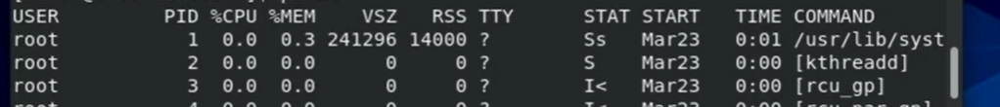
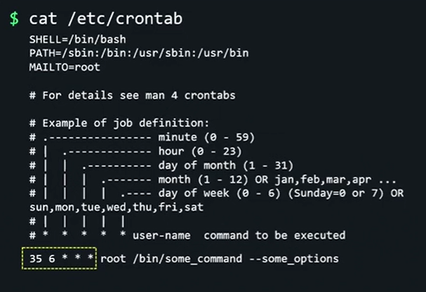
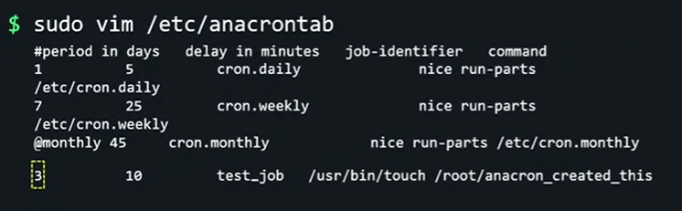
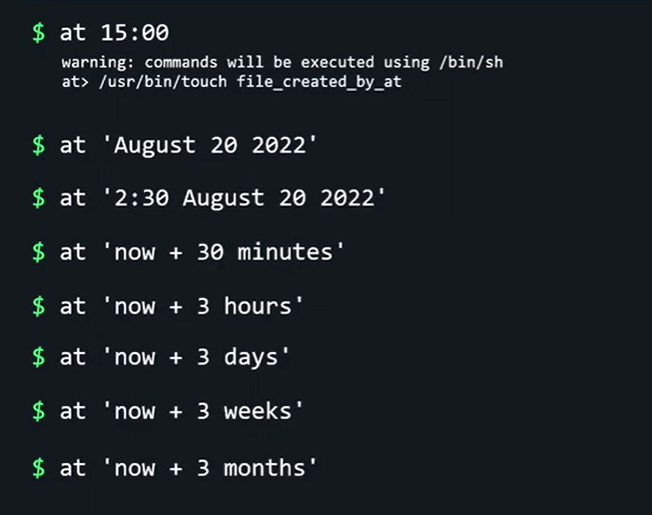
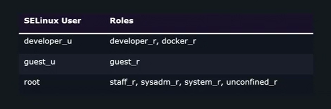
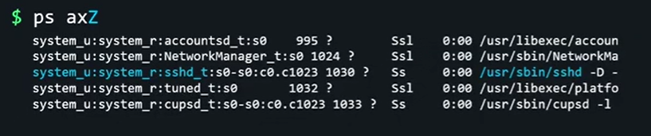
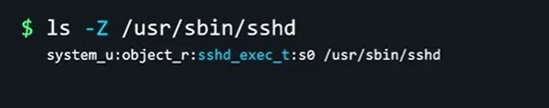

# LINUX FOUNDATION CERTIFIED SYSTEM ADMINISTRATOR (LFCS)

## Additional Resources

- web <https://kodekloud.com/courses/linux-foundation-certified-system-administrator-lfcs/>
- regxr.com
- shell scripts for beginners

## Table of Contents

1. Introduction
2. Essential Commands
3. Operation of Running Systems
4. User and Group Management
5. Networking
6. Service Configuration
7. Storage Management
8. Conclusion

## 3. Operation of Running Systems

### 3.01. Boot, reboot, and shutdown a system safely

- `sudo systemctl reboot/poweroff` - to reboot/shutdown
- `sudo systemctl reboot/poweroff --force` - to force reboot/shutdown
- `sudo systemctl poweroff --force --force` - to double force  reboot/shutdown
- `sudo shutdown 02:00` - to schedule a shutdown at a specific time
- `sudo shutdown -r 02:00` - to schedule a reboot at a specific time
- `sudo shutdown 02:00 'scheduled shutdown for offline-backup'` - to add a wall message to a scheduled shutdown

### 3.02. Boot or change system into different operating modes

- `systemctl get-default` to view default boot target
- `sudo systemctl set-default multi-user.target` to change default boot target
  - `graphical.target` - allows for multi users, enables graphical user interface
  - `multi-user.target` - allows for multi users, disables graphical user interface
  - `emergency.target` - load as few programs as possible
  - `rescue.target` - target somewhere b/w emergency and multi-user, dropped in the root shell
- `sudo systemctl isolate graphical.target` to switch temporary w/o reboot to other target

### 3.03. Install, configure and troubleshoot bootloaders

Bootloaders = starts Linux Kernel, GRUB = one of the most popular bootloader.

1. Troubleshooting  -> Rescue a CentOS Stream System -> Continue -> `chroot /mnt/sysroot` -> `grub2-mkconfig -o /boot/grub2/grub.cfg` - to generate a grub config file
2. `lsblk` to identify in which disk we should install grub to `vda` for virtual disk or `sda` for physical disk where `/boot` is located
3. `grub2-install /dev/sda` - `/dev/sda` special device file, that points to physical disk on our machine
4. `exit` -> `exit` to reboot
5. `sudo vi /etc/default/grub` - update GRUB_TIMEOUT to 1 to boot faster, this is not the file grub uses to boot, but is used by `grub.cfg`, so we have to regenerate grub config
6. `grub2-mkconfig -o /boot/grub2/grub.cfg`
7. `sudo systemctl reboot`

### 3.04. Lab: Boot and Change Operating Modes, Troubleshoot Bootloaders

### 3.05. Use scripting to automate system maintenance tasks

```shell
# script.sh
#!/bin/bash <- shabang line

# comment line

date >> /tmp/script.log
cat /proc/version >> /tmp/script.log
```

```shell
# to make script executable
chmod +x script.sh

# to run scipt 
/home/user/script.sh
./script.sh
```

```shell
# list bash built-ins
help
```

```shell
# archive-dnf.sh
#!/bin/bash

tar --create --gzip --file /tmp/archive.tar.gz /etc/dnf
```

```shell
# archive-dnf-2.sh
#!/bin/bash

if test -f /tmp/archive.tar.gz; then
    mv /tmp/archive.tar.gz /tmp/archive.tar.gz.OLD
    tar --create --gzip --file /tmp/archive.tar.gz /etc/dnf
else
    tar --create --gzip --file /tmp/archive.tar.gz /etc/dnf
fi
```

```shell
# check-grub-timeout.sh
#!/bin/bash

if grep -q '5' /etc/default/grub; then
    echo 'Grub has timeout of 5 seconds'
else
    echo 'Grub DOES NOT have timeout of 5 seconds'
fi
```

Bash scripting cheat sheet - `cat /etc/cron.hourly/0anacron`

### 3.06. Manage the startup process and services (In Services Configuration)

init system - initialization system for starting following units:

- service
- sockets
- device
- timer
- etc.

To view/edit/revert services:

- `systemctl cat sshd.service` - to view service information
- `sudo systemctl list-units --type service --all` - lists all services available
- `sudo systemctl edit --full sshd.service` - to edit service information
- `sudo systemctl revert --full sshd.service` - to revert service information

To start/stop services:

- `sudo systemctl status sshd.service`
- `sudo systemctl start sshd.service`
- `sudo systemctl stop sshd.service`
- `sudo systemctl restart sshd.service` vs. `sudo systemctl reload sshd.service` vs. `sudo systemctl reload-or-restart sshd.service`
  - restart - stops the app and restarts
  - reload - reloads configuration w/o stopping the service
- `sudo systemctl disable sshd.service` - to prevent from auto-start
  - `sudo systemctl is-enabled sshd.service` - to check for the status
- `sudo systemctl enable sshd.service` and - `sudo systemctl start sshd.service` vs. `sudo enable --now sshd.service`
- `sudo systemctl mask/unmask [SERVICE-NAME]` - prevents/enables service from being started by other services

### 3.07. Lab: Scripting, manage startup process and services

### 3.08. Diagnose and manage processes

Whenever we launch a program, it lives as a process until the program is closed.

- `ps` to view processes running on Linux. `ps a` != `ps -a`
- `ps aux` view all processes running



- USER - which user executes the command
- PID - process ID
- %CPU & %MEM - resource consumption, 100% = one CPU fully utilized
- VSZ
- RSS
- TTY
- STAT
- START - time at which the process was started
- TIME - CPU time consumed during lifetime of the process
- COMMAND - exact command with flags, COMMANDs in brackets - [] are Linux kernel processes, we will not interact with those.

Other Linux process commands:

- `top` - shows sorted processes based on CPU consumption
- `ps u [PID]` - shows information for specific PID in user oriented format
- `ps u -U [USERNAME]` - shows processes for specific user
- `pgrep -a [PROCESSNAME]` - shows PID for specific process name
- `nice -n [NR] [PROCESSNAME]` - set process niceness value, regular user 0 - +19, sudo -20 - +20
- `sudo renice [NICE-NR] [PROCESS_ID]` - to change nice value for existing process
- `ps axl` - to show nice values
- `ps axf` - to show tree-like processes w/ parent processes

#### Signals

2 Signals that cannot be avoided by any program:

- `SIGSTOP` - stops the current process
- `SIGKILL` - kills the current process, last resort signal

Other Signal commands:

- `kill -L` - lists all signals
- `sudo kill -[SIGNAL-NAME] [PROCESS_ID]` - to update signal for a process
- `sudo kill [PROCESS_ID]` - sends SIGTERM by default
- `sudo pkill [PROCESS_NAME]` - sends SIGTERM by default

#### background/foreground processes

- `sleep 180` - CTRL+C to quit the current process - SIGKILL
- `sleep 180` - CTRL+Z to stop - SIGKILL
- `fg` - to bring background process back to foreground
- `sleep 180 &` - to bring process to the background
- `jobs` to check if there are any background or paused processes
- `fg [JOB_NR]` - to bring specific background process back to foreground
- `bg [JOB_NR]` - to resume stopped job

#### `lsof`

- `sudo lsof -p [PROCESS_ID]` - to see which files/directories are opened by process
- `sudo lsof [FILE/DIRECORY]` - to see which process is using the file directory

### 3.09. Locate and analyse system log files

- `/var/log/` - default directory where all logs are stored
- `grep -r 'ssh' /var/log/` - search recursively in /var/log directory
- `tail -F /var/log/secure` - `-F` - follow mode, updates the file as we go
- `journalctl -u sshd` - to view logs for a particular service
- `journalctl -f` - follow mode for journalctl
- `journalctl -p [info|warning|err|crit]` - to specify priority of logs
- `journalctl -g '^b'` - use regex to search for particular lines
- `journalctl -S 01:00 -U 02:00` - to search for logs since/until a particular time
- `journalctl -b 0` - logs for the current boot

- `last` - shows who was logged into the computer
- `lastlog` - shows all users and their last login time

### 3.10. Lab: Manage Processes and Analyse Log Files

1. Assign a nice value of 9 to the sshd process.
    - `sudo renice -n 9 $(pgrep sshd)`

### 3.11. Schedule tasks to run at a set date and time

There are 3 common ways how to schedule tasks on Linux:

- `cron` utility - repetitive jobs, that execute jobs starting from few minutes
- `anacron` - repeats tasks starting from once per day, checks if job was executed
- `at` - tasks that only should run once

#### cron

- `cat /etc/crontab` - default system wide cron-table, do not add jobs to system wide cron-table, add to user cron instead.



- `35 6 * * *` - when cron job should be run - min, hour, day, month, day of week
  - `*` - match all possible values (every hour)
  - `,` - specifies multiple values (15,45)
  - `-` - specifies range of values (2-4)
  - `/` - specifies step (*/4) - every 4th hour, default step = 1
- `root` - username
- `/bin/some_command --some_options` - command that should be run

How to work with cron:

- `which` - identify full path of app
- `crontab -e` - modify user crontab
- `35 6 * * * /usr/bin/touch test_passed`
- `crontab -l` - see the crontab for the current user
- `sudo crontab -l` - see the crontab for the root user
- `sudo crontab -e -u [USER]` - edit crontab for other user
- `sudo crontab -r` - remove crontab
- `sudo crontab -r -u [USER]` - remove crontab for specific user

Alternative to adding tasks to cron is to use folders:

- `/etc/cron.hourly/`
- `/etc/cron.daily/`
- `/etc/cron.weekly/`
- `/etc/cron.monthly/`

Shell script should not contain any extension (like `.sh`) to be able to run in cron.

- `sudo cp shellscript /etc/cron.hourly/`
- `sudo chmod +rx /etc/cron.hourly/shellscript`
- `sudo rm /etc/cron.hourly/shellscript`

#### anacron

- `sudo vi /etc/anacrontab`



- `period in days` - 1 every day, 3 every 3 days
  - `@weekly` - to schedule jobs weekly
  - `@monthly` - to schedule jobs monthly
- `delay in minutes` - how many min after machine restart job should run
- `job-identifier` - human readable identifier
- `command` - full path to the script + pipe `command | systemd-cat --identifier=test_job`

working w/ anacron:

- `anacron -T` to test anacron for errors
- `anacron -n` - makes anacron to execute all tasks now
- `anacron -n -f` - to force anacron to execute all tasks, even if already executed

#### at

- `at 15:00`
- enter command
- `ctrd+d` to save
- run at specific day and time:



- `atq` to see what jobs are scheduled
- `at -c [JOB ID]` to see details of scheduled job
- `atrm [JOB ID]` to remove scheduled at job

### 3.12. Demo: Verify completion of scheduled jobs

- `grep cron /var/log/cron`
- `grep anacron /var/log/cron`
- `grep atd /var/log/cron`

### 3.13. Lab: Schedule Tasks and Verify Completion of Scheduled Jobs

### 3.14. Update software to provide required functionality and security

- `dnf check-upgrade` - check if there are new updates available
- `sudo dnf upgrade`

### 3.15. Manage Software

newer CentOS versions use `dnf` instead of `yum`:

- `sudo dnf repolist` - to see application repos
- `sudo dnf repolist -v` - to see additional information for the repo
- `sudo dnf repolist -all` - to see all  repos, even disabled
- `sudo dnf config-manager --enable/--disaable [REPO-ID]` - to enable/disable repositories
- `sudo dnf config-manager --add-repo [REPO-URL]` - to add 3rd party repos
- `sudo dnf search 'web server'` - search for package descriptions
- `sudo dnf info nginx` - search for package descriptions
- `sudo dnf install/reinstall/remove nginx` - install, reinstall, remove packages
- `sudo dnf group list --hidden` - list grouped apps, including hidden ones
- `sudo dnf group install/remove [GROUP-NAME]`
- `sudo dnf autoremove` - remove unused dependencies

#### Install using `wget` and `dnf`

- `wget [APPLICATION-URL][APPLICATION.rpm]`
- `sudo dnf install ./[APPLICATION.rpm]`

### 3.16. Identify the component of a Linux distribution that a file belongs to

- `sudo dnf provides /etc/anacrontab` - provides info which package installs the file
- `sudo dnf provides docker` - provides info which package contains a certain utility
- `dnf repoquery --list nginx` list of files contained in a package

### 3.17. Lab: Update, manage software, identify component

### 3.18. Verify the integrity and availability of resources

- `df -h` - disk free utility
  - `-h` = human readable format
  - `tempfs` can be ignored

- `du -sd /bin/` - disk usage - to check how much memory a folder is using
  - `-s` = summarize
  - `-h` = human readable format

- `free -h` - how much RAM memory is being used by apps
- `uptime` - shows CPU load for last 1, 5 and 15 minutes
- `lscpu` - shows details of available CPUs
- `lspci` - shows details of available hardware

Verify `xfs` file system:

- `sudo xfs_repair -v /dev/vdb1`
  - `-v` - verbose output

Verify `ext4` file system:

- `sudo fsck.ext4 -vfp /dev/vdb2`
  - `-v` - verbose output
  - `-f` - force check
  - `-p` - preen mode

how to check of programs work correctly:

- `systemctl list-dependencies` - green = running, white = stopped

### 3.19. Lab: Verify Integrity and Availability of Resources and Key Processes

### 3.10. Change kernel runtime parameters, persistent and non-persistent

kernel runtime parameters = settings for Kernel

- `sudo sysctl -a` - to see kernel runtime parameters
- `sudo sysctl -w net.ipv6.conf.default.disable_ipv6=1` - to modify kernel runtime parameter for current boot session
- create `swap-less.conf` file in `/etc/sysctl.d/` directory with updated value `vm.swapiness=29`, which will be updated on next boot
- `sudo sysctl -p /etc/sysctl.d/swap-less.conf` - to take effect of the parameter

### 3.21. List and Identify SELinux/AppArmor file and process contexts

Default user, group, others are not enough for security. SELinux - Security module for policy configuration. Each user can only assume a predefined set of roles.

`ls -Z` - to see SELinux Context Label


- user - SELinux User != Linux Username. Linux username is mapped to SELinux User
- role - each user can assume a predefined set of role
- type/domain - protective software jail/domain. Only file with proper type can enter respective process domain.
- level - like information security levels



1. only certain users can enter certain roles/types
2. it lets authorized users/processes do their job, by granting permissions they need
3. authorized users and processes are allowed to take only a limited set of actions
4. everything else is denied

- `ps auxZ` - to see processes and their security context




- `id -Z` - to see the security contect assigned to user
- `sudo semanage login -l` to see the SELinux user mapping
- `sudo semanage user -l` to see the SELinux role mapping
- `getenforce` to verify if SELinux is enabled

### 3.22. Lab: Kernel Runtime Parameters and SELinux/AppArmor

1. Change the SELinux context of /var/index.html file to httpd_sys_content_t
    - `sudo chcon -t httpd_sys_content_t /var/index.html`
2. Temporarily change the SELinux status to Permissive on this system.
    - `setenforce 0`
