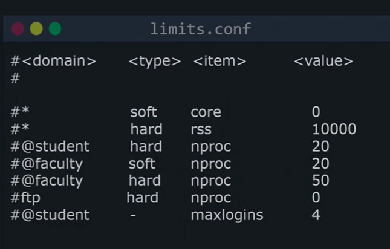

# LINUX FOUNDATION CERTIFIED SYSTEM ADMINISTRATOR (LFCS)

## Additional Resources

- web <https://kodekloud.com/courses/linux-foundation-certified-system-administrator-lfcs/>
- regxr.com
- shell scripts for beginners

## Table of Contents

1. Introduction
2. Essential Commands
3. Operation of Running Systems
4. User and Group Management
5. Networking
6. Service Configuration
7. Storage Management
8. Conclusion

## 4. User and Group Management

### 4.01. Create, delete, and modify local user accounts

Add user in Linux:

- `sudo useradd [USER]` - to add a user. Default actions are performed:
    1. new user USER is added
    2. new group USER is added, which is the primary group for the USER
    3. home directory is created `/home/USER` for personal files and program settings
    4. default shell is set at `/bin/bash`, entire login session will run in this shell
    5. `/etc/skel` files will be copied to `/home/USER`
    6. account will never expire
- `sudo useradd [USER] -s /bin/othershell -d /home/otherdirectory/` - to add a user specifying alternate shell and home directory
- `sudo useradd --system sysacc` - to create system account for applications (w/o home directory)

Check default settings:

- `useradd --defaults` - to view default activities for `useradd` command 1
- `cat /etc/login.defs` - to view default activities when creating a username

Change user settings:

- `sudo usermod --home /home/otherdirectory/ --move-home [USER]` - to change home directory for a user
- `sudo usermod --login [USER_NEW] [USER]` - to change username
- `sudo usermod --shell /bin/othershell [USER]` - to change shell for a user
- `sudo usermod --lock/--unlock [USER]` - disable/enable user
- `sudo usermod --expiredate yyyy-mm-dd/"" [USER]` - set/unset date when user account expires

Delete user commands:

- `sudo userdel [USER]` - to delete a user (user home directory will remain)
- `sudo groupdel [USER]` - to delete a group
- `sudo userdel --remove [USER]` - to delete a user, including home directory

Password settings:

- `sudo passwd [USER]` - to set a password for a user
- `sudo chage --lastday 0 [USER]` - sets user passwd as expired
- `sudo chage --lastday -1 [USER]` - to un-expire a password
- `sudo chage --maxdays 30 [USER]` - specify that passwd should be changed in 30 days
- `sudo chage --maxdays -1 [USER]` - passwd never expires
- `sudo chage --list [USER]` - check when passwd expires

View user information:

- `cat /etc/passwd`


- user id number
- group id number
- home directory
- preferred shell

ls:

- `ls -ln` to view numeric numbers of user and group


- `id` - to check currently logged in user
- `whoami` - to check username who is logged in

### 4.02. Create, delete, and modify local groups and group memberships

Groups are needed to allow several ppl to have read/write access to a directory. `Directory -> Group -> Users`:

- `WHEEL group` - like root group, users in this group can execute `sudo`
- `DOCKER group` - manage Docker containers

Primary group or login group vs. secondary or supplementary group:

- when user creates a process, that process is run as a Primary group
- when user creates a file, that file is created as a Primary group

Examples of working with groups:

- `sudo useradd [USER]` - create a user
- `sudo groupadd [GROUP]` - create a group
- `sudo gpasswd --add/--delete [USER] [GROUP]` - add/delete user to a group
- `groups [USER]` - lists groups john is part of, 1st group is primary group
- `sudo usermod --gid [GROUP] [USER]` - change users primary group
- `sudo groupmod --new-name [GROUP_NEW] [GROUP]` - to rename a group
- `sudo groupdel [GROUP]` - deletes a group, cannot delete if part of a primary group

### 4.03. Lab: Manage user accounts and groups

### 4.04. Manage system-wide environment profiles

- `printenv` - prints environment variables
- `echo $HISTSIZE` - prints environment variable value
- `HISTSIZE=2000`, changes environment variables for the current user

Add environment variables:

- `vi .bashrc` - modify env. variable for specific user, (file is locate in user's home directory)
- `sudo vi /etc/environment` - modify env. variables for all users

Add more complex things:

- add `lastlogin.sh` file in `/etc/profile.d` directory. No need to add shebang line to the script

```shell
eecho "your last login was at: " > $HOME/lastlogin
date >> $HOME/lastlogin
```

### 4.05. Manage template user environment

- add `README` file to the `/etc/skel` so that the file is copied to all new users

### 4.06. Lab: Manage system-wide environment profiles and template user environments

### 4.07. Configure user resource limits

- `sudo vi /etc/security/limits.conf` - to specify limits for particular user



- domain - username, group (@) or everyone (*),
  - user > group > everyone
- type - hard (max value), soft (startup limit, can be increased by user manually up to hard limit), "-" (both a hard limit and soft limit)
- item - `nproc` (max nr of processes), `fsize` (max file size), `cpu` (CPU time)
- value


Trinity can open 3 processes at a given time

- `sudo -iu trinity` to login as  user:
  - `i` - real login
  - `u` - specifies username


- `ulimit -a` to see current limits


- `ulimit -u 5000` to update soft limits

### 4.08. Manage user privileges

- Whoever is part of `wheel` group is allowed to use `sudo` command.
- `/etc/sodoers` defines who can use sudo and under which circumstances. To edit the file use `sudo visudo`


- `%wheel` - user/group who this policy is for
- `ALL=` - host, we can specify that rule apply only if servers hostname or IP-address has specific value
- `(ALL)` - 'run_as_user' field, list of usernames, normally `sudo ls` would run ls command as root,  but you can specify different 'run_as_user' username, if needed.
- `ALL` - command_list that can be executed as sudo

- sudoers = user/group host=(run_as_user) command_list

To add a line in sodoers that user trinity can execute commands as sudo:

- `trinity ALL=(ALL) ALL`

To add a line in sodoers that developers group can execute commands as sudo:

- `%developers ALL=(ALL) ALL`

Execute command as different user:

-  

To add a line in sodoers that trinity can only run commands as aaron  or john:

- `trinity ALL=(aaron,john) ALL`

To add a line in sodoers that trinity  can only run few commands as using sudo:

- `trinity ALL=(ALL) /bin/ls, /bin/stat`

Not require password for sudo:


### 4.09. Lab: Configure user resource limits and user privileges

### 4.00. Manage access to the root account

- `sudo [COMMAND]` is basically the same as if root user would have executed that command
- `sudo --login` or `sudo -i` to login as root, `logout` to logout from root
- `su --login` - if user does not have root privileges but knows root password
- if root user is locked you can use `sudo --login` but can not use `su --login`

### 4.11. Configure PAM (13:03)

- PAM = Pluggable Authentication Modules.

With PAM we can tell `su` utility to authenticate us in a different way, than providing password, for example w/ special USB stick.

- `sudo vi /etc/pam.d/su`


1st column:

- account - some actions related to user account (for example, to prevent user from logging in after certain time)
- auth - to establish the identity of user/program (can provide extra privileges after successful authentication)
- password - used to update password
- session - to prepare users session (write into log file that user has successfully logged in)

2nd column (control field), listed top to bottom:

- required - for MFA, both auth should be required
- sufficient - for MFA, if one is OK, success
- requisite - module has to be successful
- etc.

3rd column:

- `man pam_[tab]` manuals for all the PAM modules
  - `pam_wheel` - only permit root access to members of group wheel


### 4.12. Lab: Manage access to the root account and configure PAM

### 4.13. Feedback
