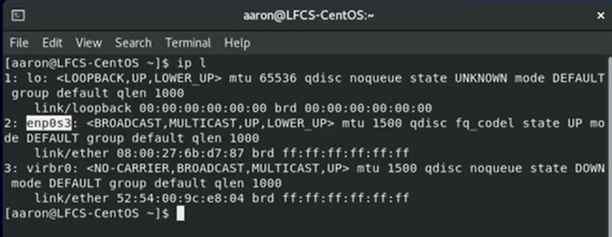
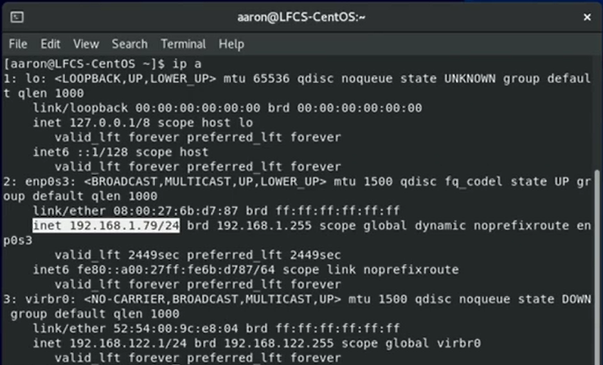
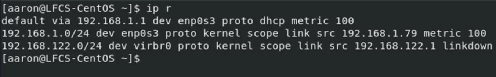
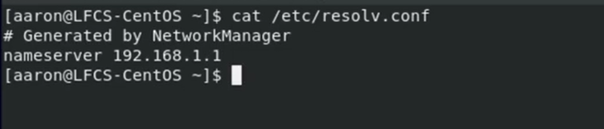
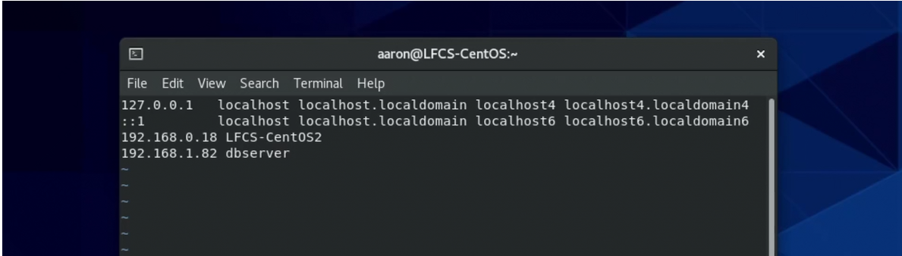
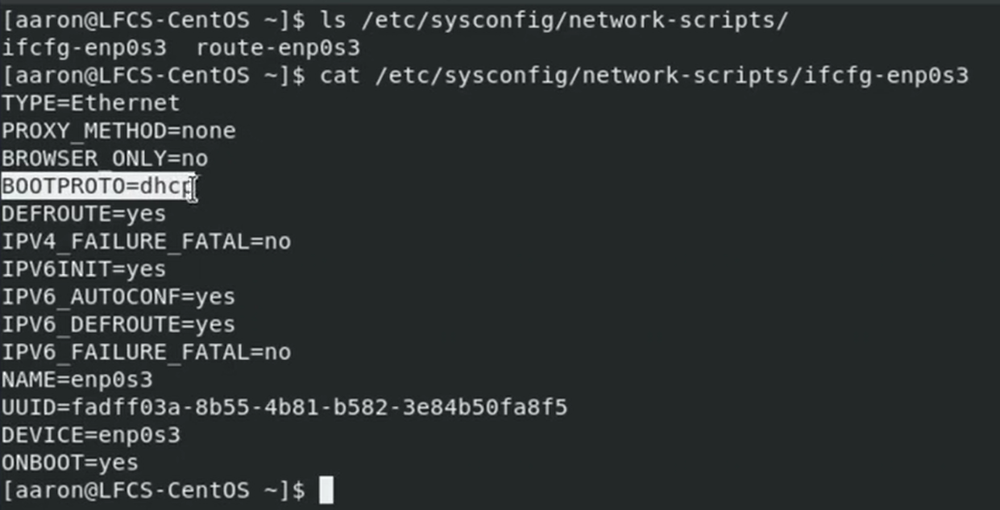
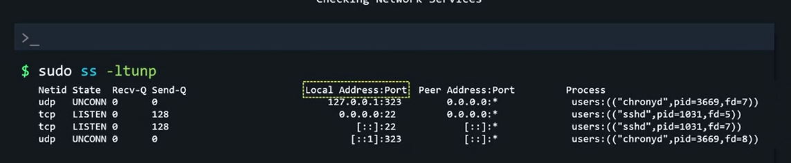
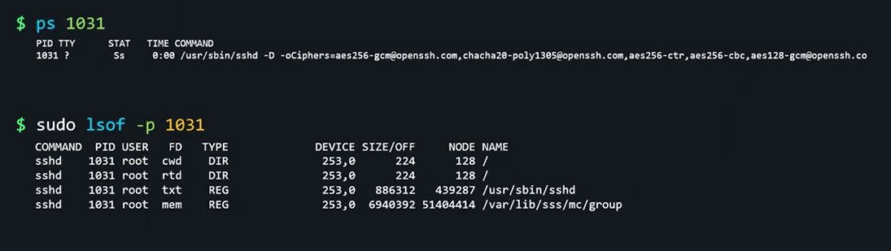
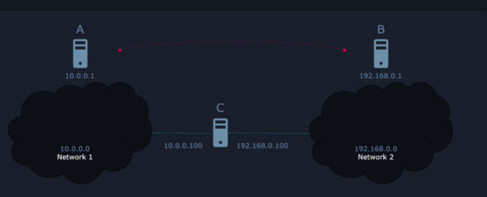

# LINUX FOUNDATION CERTIFIED SYSTEM ADMINISTRATOR (LFCS)

## Additional Resources

- web <https://kodekloud.com/courses/linux-foundation-certified-system-administrator-lfcs/>
- regxr.com
- shell scripts for beginners

## Table of Contents

1. Introduction
2. Essential Commands
3. Operation of Running Systems
4. User and Group Management
5. Networking
6. Service Configuration
7. Storage Management
8. Conclusion

## 5. Networking

### 5.01. Configure networking and hostname resolution statically or dynamically

- `ip link show` or `ip l` - shows network interface name. Look for 1st actual network adapter-  non LOPPBACK adapter.

- `ip addresses show` or `ip a` - to see IP addresses configured for adapters.
  - `/24` - CIDR range, means that 3/4 of the address is allocated for the network, last 1/4th of IP address can be allocated to subnet in this case 2^(32-24) = 2^8 = 256 addresses.\

- `ip route show` or `ip r` - to see the routing table
  - `default via` - default gateway

- `cat /etc/resolv.conf` - to see the default DNS server

- `cat /etc/hosts` - to see the device hostname
  - you can manually add hostnames to be resolved just by updating this file

- `ls -la /etc/sysconfig/network-scripts/` - shows default network configuration
  - `BOOTPROTO=dhcp` for automatic IP
  - `BOOTPROTO=none` for manual IP

In RedHat family a program Network Manager is default for managing network related tasks. Includes several tools:

- `nmtui` - for Network Manager w/ UI, move around using tab or arrow keys
- `nmcli` - for Network Manager w/o UI
  - `nmcli device reapply [DECVICENAME]` to automatically re-apply new configuration

### 5.02. Configure network services to start automatically at boot

- `systemctl status NetworkManager` - check if Network Manager is running. If not running, install and auto-start
  - `sudo dnf install NetworkManager`
  - `sudo systemctl enable --now NetworkManager`

- `nmcli connection show`
- `sudo nmcli connection modify [NAME] autoconnect yes`

### 5.03. Start, stop, and check the status of network services

- `sudo ss -tunlp` check which programs are running and waiting for network connections
  - `-l` - listening
  - `-t` - TCP
  - `-u` - UDP
  - `-n` - numeric values, shows port nr
  - `-p` - processes

- `127.0.0.1` means the connection is waiting for location connection only and denies connections from outside
- `0.0.0.0` means the connection is waiting for external connection
- `[::]` means the connection is waiting for external ipv6 connections

To check additional information for running services:

- `systemctl status chronyd`
- `systemctl status ssh`
- `ps [PID mentioned in ss command]`
- `sudo lsof -p [PID mentioned in ss command]`

### 5.04. Lab: Configure networking, start/stop/check status of network services

1. Identify the transient hostname of this system and save the value in /home/bob/t-hostname file.
    - `hostnamectl`
2. Now, update the transient hostname to the static hostname on this system.
    - `sudo hostnamectl set-hostname dev-host01`

### 5.05. Implement packet filtering

To enhance security, a firewall can be added to a system and this firewall will filter out what network packets are allowed to come into our system (ingress) and even what network packets are allowed to go out. In Red Hat family CentOS included there is a tool called FirewallD to simplify packet filtering. This firewall manager puts every network interface in a separate zone. And each zone has a specific set of rules.

For example a computer w/ wireless network card and a wired network card. We could specify a zone for:

- create drop zone to  wireless network interface, blocking all incoming traffic
- add trusted zone to wired network interface, allowing all incoming traffic.

Default zone is public, which blocks every incoming connection, except what we choose to allow.

- `firewall-cmd  --get-default-zone` - checks for default zone
- `firewall-cmd  --set-default-zone=public` - sets default zone for the interface
- `sudo firewall-cmd  --list-all` - get current firewall rules
  - `services:` will list allowed connections for specific services
- `sudo firewall-cmd  --info-service=cockpit` - shows port number for specific service

Choose one option for allowing incoming connection:

- `sudo firewall-cmd --add-service=http` - allow incoming traffic for a specific service
- `sudo firewall-cmd --add-port=80/tcp` - allow incoming traffic for a specific port

Choose one option for removing access for incoming connection:

- `sudo firewall-cmd --remove-service=http` - remove incoming traffic for a specific service
- `sudo firewall-cmd --remove-port=80/tcp` - remove incoming traffic for a specific service

Rules based on where traffic is coming from, these rules will not be permanent:

- `firewall-cmd --get-active-zones` - get enables zones for the firewall
- `sudo firewall-cmd --add-source=10.11.12.04/24 --zone=trusted` - add IP addresses to the zone
- `sudo firewall-cmd --remove-source=10.11.12.04/24 --zone=trusted` - removes IP addresses from the zone

2 options to make rule permanent:

1. `firewall-cmd --runtime-to-permanent` - makes all the runtime rules persistent
2.
    - create a firewall rule in runtime: `sudo firewall-cmd --add-port=80/tcp`
    - make specific runtime rule persistent: `sudo firewall-cmd --add-port=80/tcp --permanent`

### 5.06. Statically route IP traffic

In the picture above C is a router, its task will be to route the packets b/w A and  B. In order to do that we need to add network route to A and B.

- for A in to reach B - `sudo ip route add 192.168.0.0/24 via 10.0.0.100 dev enp0s3`

To make connection persistent:

- `nmcli connection show` - check which network interface is active
- `sudo nmcli connection modify enp0s3 +ipv4.routes "192.168.0.0/24 10.0.0.100"` - add rule to persistent
- `sudo nmcli device reapply enp0s3"` - add rule to current session
- `ip route show` will show you added rule
- `sudo nmcli connection modify enp0s3 -ipv4.routes "192.168.0.0/24 10.0.0.100"` - remove to persistent

### 5.07. Synchronize time using other network peers

CenOS uses crony to update system time.

- `systemctl status cronyd` to check for service status
- `timedatectl` - to check if time is synchronized and MTP service is active
- `sudo timedatectl set-timezone America/Net_York` - specify time zone
- `sudo timedatectl set-ntp true` - enable NTP service

### 5.08. Lab: Packet filtering, static routes and time synchronization
