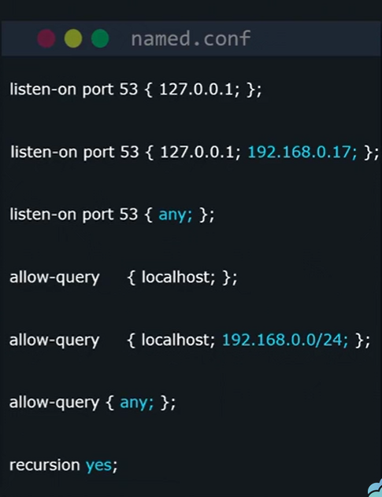
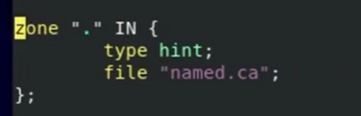
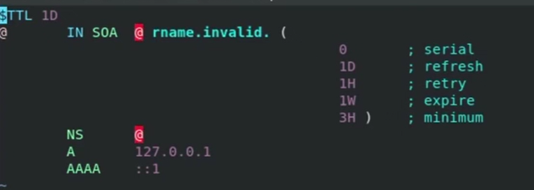

# LINUX FOUNDATION CERTIFIED SYSTEM ADMINISTRATOR (LFCS)

## Additional Resources

- web <https://kodekloud.com/courses/linux-foundation-certified-system-administrator-lfcs/>
- regxr.com
- shell scripts for beginners

## Table of Contents

1. Introduction
2. Essential Commands
3. Operation of Running Systems
4. User and Group Management
5. Networking
6. Service Configuration
7. Storage Management
8. Conclusion

## 6. Service Configuration

### 6.01. Configure a caching DNS server

Bind is a popular app for hosting a DNS server.

- `sudo dnf install bind bind-utils -y`
- `dig` - used to query DNS info

To change Bind config

1. `ip a` - get IP address of the VM
2. `sudo vi /etc/named.conf` - edit the bind config file
3. `man named.conf` - to see options of the file

From `listen-on port 53 { 127.0.0.1; };` to:

- `listen-on port 53 { 127.0.0.1; [IP_ADDRESS]; };` - to accept connections from other servers on internal network
- `listen-on port 53 { any; };` - to accept connections from any network

From `allow-query { localhost; };` to:

- `allow-query { localhost; [IP_ADDRESS/CIDR]; };` - to allow any VM from the internal network to request information from DNS DB from Bind
- `allow-query { any; };` - to allow  VM from any network to request information from DNS DB from Bind

- `recursion yes; ' - to allow Bind to query other DNS servers on the internet



To start and enable bind:

- `sudo systemctl enable --now named`
- `sudo firewall-cd --add-service=dns`
- `sudo firewall-cd --add-service=dns --permanent`
- `dig @localhost google.com` and `dig @localhost google.com` - to verify if bind is working as expected, check for query time, it should be `0 msec` for 2nd query.

### 6.02. Maintain a DNS zone

- Domain Name System (DNS) or nameserver = phone book of the internet.
- DNS contains data associated with the certain domain.

Edit a DNS zone in bind config file: `sudo vi /etc/named.conf` and create a new zone for `example.com`:



```shell
zone "example.com" IN {
            type master; #master/slave
            file "example.com.zone"; # where our zone file can be found
};
```

Add `example.com.zone` file in `/var/named/` directory:

- `sudo cp --preserver=ownership /var/named/named.localhost /var/named/example.com.zone` to copy using named.localhost  file as a template
- `sudo vi /var/named/example.com.zone` to edit our zone file:



- `$TTL 1D` = time to live, tells other servers how long the value should be cashed
- `SOA` = start of authority, information how synchronization b/w DNS servers should occur.
- `@` - applies to the original domain in this case `example.com`

All data below in composed in following format: domain -> type of entry -> Data for the entry:

- `@            NS    ns1.example.com.` - Name Server field for 1st server
- `@            NS    ns2.example.com.` - Name Server field for 2nd server
- `ns1          A     10.11.12.9` - specify IP  for ns1
- `ns2          A     10.11.12.1` - specify IP  for ns2
- `@            A     203.0.113.15` - specify IP address for example.com
- `@            AAAA  [IPV6-address]` - specify IPv6 address for example.com
- `www          CNAME 203.0.113.15` - specify canonical name for www.example.com
- `example.com. MX 10 mail.example.com.` - specify mail address
- `mail         A     203.0.113.80` - specify IP address for mail server
- `example.com. TXT   "We can write anything in here!"` - to specify txt field

Reload or restart named service to load new config file and verify config using dig:

- `sudo systemctl restart named.service`
- `dig @localhost example.com`
- `dig @localhost example.com ANY` to see all records available

### 6.03. Lab: Configure caching DNS server and manage DNS zones

### 6.04. Configure email aliases

aaron@example.com mailbox is located in /var/spool/mail/aaron/

- email alias - email send to different email address is forwarded to different user in Linux, for example, marketing@example.com -> /var/spool/mail/aaron/

Postfix application works as a mail server. Install and auto-start:

- `sudo dnf install postfix`
- `sudo systemctl enable --now postfix`
- `sendmail [USER]@localhost <<< "testing testing 1, 2, 3"`
- `cat /var/spool/mail/[USER]/` - verify email received

Create alias for current username:

- `sudo vi /etc/aliases` - define new alias
  - `[NEW-ALIAS]: [USER1],[USER2],[USER3]` - add line at the end of the file
- `sudo newaliases`
- `sendmail [USER]@localhost <<< "testing testing 1, 2, 3"`

Create alias for external mail username:

- `sudo vi /etc/aliases` - define new alias
  - `[NEW-ALIAS]: [USER1@EMAIL.COM]` - forwards email externally
- `sudo newaliases`
- `sendmail [NEW-ALIAS]@localhost <<< "testing testing 1, 2, 3"`

### 6.05. Configure an IMAP and IMAPS service

IMAP = Internet Message Access Protocol.
IMAPS = Internet Message Access Protocol Secure

A common daemon on Linux is dovecot.

- `sudo dnf install dovecot`
- `sudo systemctl enable --now dovecot`
- `sudo firewall-cmd --add-service=imap,imaps`
- `sudo firewall-cmd --add-service=imap,imaps --permanent`

- `sudo vi /etc/dovecot/dovecot.conf` - main configuration file.
  - `protocols = imap` - to specify protocols
  - `listen = 10.0.0.1` - to allow incoming traffic only from a specific IP address
- `ls -la /etc/dovecot/conf.d/ - list all configuration files for dovecot
  - `sudo vi /etc/dovecot/conf.d/10-master.conf` - to change default port numbers for dovecot
  - `sudo vi /etc/dovecot/conf.d/10-mail.conf` - to change mail location
  - `sudo vi /etc/dovecot/conf.d/10-ssl.conf` - to change SSL location

### 6.06. Lab: Configure email aliases and IMAP/IMAPS service

1. Send an email to root@example.com from the currently logged in user i.e bob.
    - `echo "Message Body" | mailx -s "Subject Line" recipient`

### 6.07. Configure SSH servers and clients

#### Edit configuration of SSH daemon config file

- `man sshd_config`
- `sudo vi /etc/ssh/sshd_config`
  - `Port 22` - to change default port nr
  - `AddressFamily any` - which address family to use - IPv4/IPv6
  - `ListenAddress` - to allow connection only from a specific IP
  - `PermitRootLogin` - to allow/deny root from login using SSH
  - `PasswordAuthentication` - to allow/disable login using passwords

To enable config to particular user:

```shell
  Match User [USER]
    PasswordAuthentication yes
```

#### Edit configuration of SSH daemon client file

- `man ssh_config` to see configurations available to SSH client
- `sudo vi /etc/ssh/ssh_config`
  - `X11Forwarding` - to allow graphical connection
- `vi ~/.ssh/config` to add default username/hostname to your SSH settings

```shell
Host centos
    Hostname 10.12.12.12
    Port 22
    Username aaron
```

- `chmod 600 ~/.ssh/config` - to remove access
- `ssh centos` login using defined config file

#### Login using Login using keys

1. Generate private/public key on the client machine `ssh-keygen`, enter passphrase to encrypt the private key
    - private key is saved as `~/.ssh/id_rsa`
    - public key is saved as `~/.ssh/id_rsa.pub`
2. copy public key to the machine: `ssh-copy-id USER@IP`. Public key will be copied to `/home/USER/.ssh/authorized_keys` on the host.

### 6.08. Restrict access to the HTTP proxy server

Outgoing web connection -> proxy server -> external website

proxy server can perform following activities:

- to scan web traffic
- to prevent from d-loading files
- to block websites
- to cache websites

Install commonly used proxy server Squid:

- `sudo dnf install -y squid`
- `sudo systemctl enable --now squid`
- `sudo firewall-cmd --add-service=squid`
- `sudo firewall-cmd --add-service=squid --permanent`

To define access rules:

- `sudo vi /etc/squid/squid.conf`

`acl localnet src 10.0.0.0/8` - Access Control List of IPs which are allowed to to browse  
`acl ssl_ports port 443` - allow specific ports
`acl safe_ports port 80` - allow specific ports
`acl youtube dstdomain .youtube.com` - to define `DeSTination  domain` for all youtube.com subdomains

To apply access rules:

- Deny rules first, then allow rules, as rules are evaluated top to bottom
- `http_access deny youtube` - to only allow access to safe ports
- `http_access deny !safe_ports` - to only allow access to safe ports
- `http_access deny CONNECT !ssl_ports` - to only allow access to SSL port
- `http_access deny to_localhost` - to deny proxy server users accessing other services hosted on squid server
- place all rules before `http_access deny all`

### 6.09. Lab: Configure SSH servers and clients and restrict access to the HTTP proxy server

### 6.10. Configure an HTTP server

If we want to host a website we need to create a HTTP server, default HTTP on centOS is Apache, install that using `sudo dnf install httpd`. Default port is 80 or 443, but by default, http listens to port 80 only.

Allow firewall to allow connection to HTTPS/HTTPS ports:

- `sudo firewall-cmd --add-service=http`
- `sudo firewall-cmd --add-service=https`
- `sudo firewall-cmd --runtime-to-permanent`

#### set up HTTP

- `man httpd.conf` - to see additional Apache details
- `sudo vi /etc/httpd/conf/httpd.conf`
  - `Listen 80` default port for listening for connections
  - `Listen 10.11.12.9 80` to allow only incoming connections from specific IP
  - `ServerAdmin root@localhost` to change default email contact information
  - `ServerName www.example.com:80` to specify DNS or IP name
  - `DocumentRoot "/var/www/html"` to specify directory for the website
- `sudo vi /etc/httpd/conf.d/two-webssites.conf` - to specify that VM should host 2 websites:

  ```shell
  <VirtualHost *:80>
      ServerName store.example.com
      DocumentRoot /var/www/store/
  </VirtualHost>

  <VirtualHost *:80>
      ServerName blog.example.com
      DocumentRoot /var/www/blog/
  </VirtualHost>

  <VirtualHost 10.11.12.9:80>
      ServerName internal.example.com
      DocumentRoot /var/www/blog/
  </VirtualHost>

  <VirtualHost 203.0.113.5:80>
      ServerName external.example.com
      DocumentRoot /var/www/blog/
  </VirtualHost>
  ```

- `apachectl configtest` - to verify entered configuration
- `echo "This is the blog" | sudo tee -a /var/www/blog/index.html` - to add index file
- `echo "This is the store" | sudo tee -a /var/www/store/index.html` - to add index file
- `sudo systemctl reload httpd` - to apply the settings

#### Set up HTTPS

- `sudo dnf install mod_ssl`
- generate TLS certs
- `sudo vi /etc/httpd/conf.d/ssl.conf`
  - `Listen 443 https` default port for listening for connections

```shell
# default settings for CertBot

<VirtualHost *:443>
    ServerName www .example.com
    SSLEngine on
    SSLCertifacateFile "/path/to/file.cert"
    SSLCertificateKeyFile "/path/to/file.key"
</VirtualHost>
```

#### enable additional modules

- `ls /etc/httpd/conf.modules.d/` - list modules
- `sudo vi /etc/httpd/conf.modules.d/00-mpm.conf` - allows to edit conf for a multi processing module
  - `LoadModule mpm_event_module_modules/mod_mpm_event.so` - to enable/disable specific mpm modules
- `sudo vi /etc/httpd/conf.modules.d/00-base.conf` - allows to specify default modules

### 6.11. Configure HTTP server log files

Http daemon keeps track if important events and keeps those events in 2 log files:

- error log - `sudo vi /var/log/httpd/logs/error_log`
- access log - `sudo vi /var/log/httpd/logs/access_log` - who visited, what pages, what browser, etc
- `sudo vi /etc/httpd/conf.d/two-webssites.conf` - to specify diff logging file for each website:

```shell
<VirtualHost *:80>
    ServerName store.example.com
    DocumentRoot /var/www/store/
    CustomLog /var/log/httpd/store.example.xom_access.log combined
    ErrorLog /var/log/httpd/store.example.xom_error.log
</VirtualHost>

<VirtualHost *:80>
    ServerName blog.example.com
    DocumentRoot /var/www/blog/
    CustomLog /var/log/httpd/blog.example.xom_access.log combined
    ErrorLog /var/log/httpd/blog.example.xom_error.log
</VirtualHost>
```

### 6.12. Restrict access to a web page

- `sudo vi /etc/httpd/conf/httpd.conf` - to edit main conf file
  - `DocumentRoot "/var/www/html"` - root directory for main website
  - `<Directory "/var/www/html">` - allows to modify access
    - `Options Indexes FollowSimLinks` - allows Indexes to httpd and follow simlinks
    - `AllowOverride None` - allows .htaccess
    - `Require all granted` - controls who can get stuff from this server for specific directory

```shell
<Directory "/var/www/html/admin">
    Require all denied
</Directory>

<Directory "/var/www/html/admin">
    Require ip 192.168.1.1 203.0.1.113
</Directory>  

<Files ".ht">
    Require all denied
</Files>  
```

To create a password protected part of the website

- `sudo htpasswd -c /etc/httpd/passwords aaron`
  - `-c` creates or overwrites

```conf
<Directory "/var/www/html/admin">
    AuthType Basic
    AuthBasicProvider file
    AuthName "Secret admin page"
    AuthUserFile /etc/httpd/passwords
    Require valid-user
</Directory>  
```

### 6.13. Lab: Configure HTTP server and log files, restrict access to web pages

### 6.14. Configure a database server

Maria DB is a fork of MySQL.

- `sudo dnf install mariadb-server`
- `sudo systemctl enable --now mariadb`
- `sudo firewall-cmd --add-service=mysql` - allow firewall connection
- `sudo firewall-cmd --add-service=mysql --permanent` - allow firewall connection
- `mysql -u root` - logs in as root user
- `mysql_secure_installation` - to restrict access to maria DB
- `sudo vi /etc/my.cnf` - edit main conf file
- `sudo vi /etc/my.cnd.d/mariadb-server.cnf` - edit conf file file for Maria DB
  - `datadir=/var/lib/mysql` - main data directory
  - `bind-address=10.0.0.5` - allows connection only from a specific IP
- `sudo vi /etc/my.cnd.d/mysql-server.cnf` - edit conf file file for MySQL

### 6.15. Manage and configure containers

### 6.16. Manage and configure Virtual Machines

- `qemu` - Quick Emulator - emulates a virtual computer
- `kvm` - Kernel Based Virtual Machine - code in Kernel, that uses hardware to speed up VM
- `virsh` - tool that lets you manage VMs in CLI

- `sudo dnf install libvirt qemu-kvm`
  - `libvirt` - includes utilities to manage VMs
  - `qemu-kvm` - lets us create and run VMS

- `vim testmachine.xml`:

  ```XML
  <domain type="qemu">
    <name>VM2</name>
    <memory unit="MiB">125</memory>
    <vcpu>1</vcpu>
    <os>
      <type arch='x86_64'>hvm</type>
    </os>
  </domain>
  ```

- `virsh define testmachine.xml`
- `virsh list --all`
- `virsh start/reboot/reset/shutdown/destroy/undefine/autostart TestMachine`
- `virsh dominfo TestMachine` - to see resources allocated
- `virsh setvcpus TestMachine 2 --config --maximum` - to change max nr of CPU allocated for machine
- `virsh setvcpus TestMachine 2 --config` - to change nr of CPU allocated for machine

### 6.17. Lab: Configure database server, manage containers and VMs
