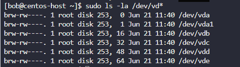
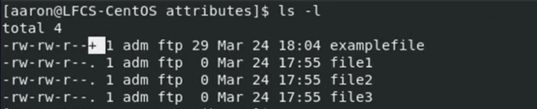

# LINUX FOUNDATION CERTIFIED SYSTEM ADMINISTRATOR (LFCS)

## Additional Resources

- web <https://kodekloud.com/courses/linux-foundation-certified-system-administrator-lfcs/>
- regxr.com
- shell scripts for beginners

## Table of Contents

1. Introduction
2. Essential Commands
3. Operation of Running Systems
4. User and Group Management
5. Networking
6. Service Configuration
7. Storage Management
8. Conclusion

## 7. Storage Management

Disk -> Partition -> File System -> Mount Point

### 7.01. List, create, delete, and modify physical storage partitions

Partitioning - logically separating physical device.

- `lsblk` - to list available block devices

- disk = virtual/physical device
- part = partition

Block devices (both disks and partitions) are found in certain files in `/dev/` directory.

- `sudo fdisk --list /dev/sda` - to list partitions on a disk.

- `sudo cfdisk /dev/sdb` - to create partitions on a disk
    1. Select label type - `gpt`
    2. Free Space -> New
      - Specify Partition Size
      - Specify Type:
        - Linux Filesystem - for generic files
        - Linux Swap - for swap
        - EFI System - for boot
    3. Write

### 7.02. Configure and manage swap space

Swap allows to free RAM by storing data in swap file.

- `swapon --show` - shows available swap drives, utilization

To create a new swap partition:

- `lsblk` to check for available partitions
  1. `sudo cfdisk /dev/sdb` - create a swap partition `/dev/vdb3`
  2. `sudo mkswap /dev/vdb3` - creates partition as a swap partition, does not persist
  3. `sudo swapon /dev/vdb3` - enables Swap partition
- `sudo swapoff /dev/vdb3` - to remove partition from swap

To create a new swap file:

- `sudo dd if=/dev/zero of=/swap bs=1M count=128 status=progress` - creates a 128MB Swap file located at `/swap`.
- `sudo chmod 600 /swap` - set permissions, so that only root can rad/write to the file.
- `sudo mkswap /swap`
- `sudo swapon /swap`

### 7.03. Lab: Manage partitions and swap space

1. Increase the existing swap (i.e `/swapfile`) size by 1GB.
    1. `sudo swapoff /swapfile`
    2. `sudo dd if=/dev/zero of=/swapfile bs=1M count=1024 oflag=append conv=notrunc`
    3. `sudo mkswap /swapfile`
    4. `sudo swapon /swapfile`

### 7.04. Create and configure file systems

By default centOS uses `xfs` file system, `ext4` can be used as well.

- `man mkfs.xfs`
  - `sudo mkfs.xfs -i size=512 /dev/sbd1` to specify inode size
  - `sudo mkfs.xfs -L "BackupVolume" /dev/sbd1` to specify label
- `sudo xfs_admin -L "OtherLabel" /dev/sbd1` - to change labels for xfs filesystem
- `man mkfs.ext4`
  - `sudo mkfs.ext4 -L "BackupVolume" -N 500000 /dev/sbd2` to specify ext4 file system
  - `sudo tune2fs -L "OtherLabel" /dev/sbd2` to change label for ext4 file system
  
### 7.05. Configure systems to mount file systems at or during boot

File system must be mounted before we can start to create files and directories.

Mount/unmount manually:

- `sudo mount /dev/vdb1 /mnt/` - to mount
- `sudo touch /mnt/testfile` - now we ca create a file in mounted partition

- `sudo umount /mnt/` - to unmount FS

Mount using `fstab`:

1. `sudo mkdir /mybackups/` - create a directory
2. `man fstab`
3. `sudo vi /etc/fstab` - create a directory
    
    1. `/dev/mapper/cs-root` - points to a partition
    2. `/` - mount point
    3. `xfs` - file system type `xfs`/`ext4`
    4. `defaults` - mount options
    5. `0` - if backup using dump is disabled/enabled, usually 0
    6. `0` - what happens when errors are detected: 0 (file system is never scanned for errors ); 1 (scan priority 1, usually for `/root`); 2 (priority 2, for other FS).
4. `/dev/vdb1 /mybackups  xfs   defaults  0 2` - to automount `/mybackups`
5. `/dev/vdb2 none        swap  defaults  0 0` - to automount swap drive
6. `systemctl daemon-reload` to update `systemd`
7. Verify /w `lsblk`

### 7.06. Lab: Create file systems and mount them at boot

Done!

### 7.07. Configure systems to mount file systems on demand

On-demand mounting - useful for remote File Systems.

- `sudo dnf install -y autofs  && sudo systemctl enable --now autofs`
- `sudo dnf install -y nfs-utils &&  sudo systemctl enable --now nfs-server`
- `sudo vi /etc/exports` add line
  - `/etc 127.0.0.1(ro)` - allows `/etc` directory to be accessible only from localhost (`ro` - read only)
- `sudo systemctl reaload nfs-server`
- `sudo vi /etc/auto.master` add line
  - `/shares/ /etc/auto.shares --timeout=400`
  - `--timeout=400` default timeout = 300s
  - `/shares/` will use directory /shares/ for mapping
- `sudo vi /etc/auto.shares` add line
  - `mynetworkshare -fstype=auto 127.0.0.1:/etc`
  - `mynetworkshare -fstype=nfs4 127.0.0.1:/etc`
  - `mynetworkshare -fstype=auto.ro 127.0.0.1:/etc`
  - `mynetworkshare -fstype=auto.ro nfs1.example.com:/etc`
  - `mynetworkshare -fstype=auto.ro :/dev/vdb2`
- sudo vi /etc/auto.master` add line
  - `/- /etc/auto.shares --timeout=400`
  - `/-` there is no parent directory defined
- sudo vi /etc/auto.shares` add line
  - `/mynetworkshare -fstype=auto 127.0.0.1:/etc` - if no parent directory, then absolute path should be used
- `sudo systemctl reaload auto-fs`

### 7.08. Evaluate and compare the basic file system features and options

- `findmnt` - shows all mount points
  
- `findmnt -t xfs,ext4` - shows specific mount points

To specify mount options manually:

- `sudo mount -o ro,noexec /dev/vdb2 /mnt` - to specify options to mount points
- `sudo mount -o remount,rw /dev/vdb2 /mnt` - to specify options for already mounted drives

To specify mount options at boot time:

- `sudo vi /etc/fstab` - add a line:
  - `/dev/vdb1  /mybackup xfs ro,noexec 0 2` you can specify mount options in 4th column

### 7.09. Lab: Mount filesystems on-demand, FS features and options

### 7.10. Manage and configure LVM storage

LVM = Logical Volume Manager - `sudo dnf install lvm2`:

- PV - Physical Volume
- VG - Volume Group - like a virtual disk
- LV - Logical Volume - like a partition for Volume Group
- PE - Physical Extent

PV - Represent Real Storage Devices - Entire SSD, sometimes partitions

- `sudo lvmdiskscan` - to see available physical volumes

- `sudo pvcreate /dev/sdc /dev/sdd /dev/sde` - to create  physical volume from available devices
- `sudo pvs` - to see available Physical Volumes
- `sudo vgcreate my_volume /dev/sdc /dev/sdd` - to create a volume group
- `sudo vgextend/vgreduce my_volume /dev/sde` - to extend/shrink a volume group with additional physical volume
- `sudo vgs` - to see available Volume Groups

- `sudo lvcreate --size 2G --name partition1 my_volume` - to create a partition for Volume Group
- `sudo lvs` - to see Logical Volume

### 7.11. Create and configure encrypted storage

To encrypt a storage device we can use `cryptsetup` that encrypts in 2 modes:

Plain mode:

- `sudo cryptsetup --verify-passphrase open --type plain /dev/vde mysecuredisk`
  - `--verify-passphrase` ask for passphrase twice
  - `open` - action to perform - open this device for reading and writing encrypted data
- `sudo cryptsetup close mysecuredisk`

LUKS -  Linux Unified Key Setup mode:

- `sudo cryptsetup luksFormat /dev/vde`
- `sudo cryptsetup open /dev/vde mysecuredisk`
- `sudo cryptsetup close mysecuredisk`

### 7.12. Lab: Manage LVM and encrypted storage

### 7.13. Create and manage RAID devices

RAID can glue together several disks - two 1 TB disk -> 2B total space.

- Level 0 RAID = several disks combined in one storage space, not redundant
- Level 1 RAID = mirrored raid, file is copied to  all disks
- Level 5 RAID = keeps disk parity. If one disk from 3 is lost, all data is saved. Three 1 TB disks = 2 TB of parity space. 10 1 TB disks = 9 TB of parity space.
- Level 6 RAID = keeps disk parity. If 2 disk from 4 is lost, all data is saved.
- Level 1+0 RAID = Four 1 TB drives gives us 2 TB total

Raid commands:

- `sudo mdamd --create /dev/md0 --level=0 --raid-devices=3 /dev/vdc dev/vdd dev/vde` - creates Level 0 Raid, w 3 disks
- `sudo mkfs.nfs /dev/md0`
- `sudo mdamd stop /dev/md0` - stops Level 0 Raid
- `sudo mdamd --zero-superblock /dev/vdc /dev/vdd /dev/vde` - stops raid from being created automatically
- `sudo mdamd --create /dev/md0 --level=1 --raid-devices=2 /dev/vdc dev/vdd --spare-devices=1 dev/vde` - add spare disk to an array
- `sudo mdamd --create /dev/md0 --add/remvoe /dev/vde` - add/remove device to an array
- `cat /proc/mdstat` - information about active RAID configs

### 7.14. Create, manage and diagnose advanced file system permissions

#### ACL

- `sudo setfacl --modify user:aaron:rw examaplefile` Set File Access Control List attribute read write for aaron for `examplefile`

`+` indicates that file `acl` has been enabled.

- `sudo getfacl examaplefile` lists `acl` for the file

- `sudo setfacl --resursive --modify user:aaron:rw /dir1` Set recursive `acl` for directory and its contents

#### change attributes

- `sudo lsattr +a newfile` - lists attributes
- `sudo chattr +a newfile` - append only
- `sudo chattr +a newfile` - immutable only

### 7.15. Setup user and group disk quotas for filesystems

- `sudo dnf install quota`
- `sudo vi /etc/fstab`
- `/dev/vdb1 /mybackups xfs defaults,usrquota, grpquota 0 2` add `usrquota`, `grpquota` to enable quotas,
- `mkdrir /mybackups/aaron`
- `chown aaron:aaron /mybackups/aaron`
- `fallocate --length 100M /mybackups/aaron/100Mfile` - to set a user file limit
- `sudo edquota --user aaron` - to edit quotas for users
- `sudo quota --edit-period` - to edit periods for quotas
- `sudo edquota --group adm` - to edit quotas for groups

### 7.16. Lab: Manage RAID, advanced permissions, and disk quotas

### 7.17. Feedback
